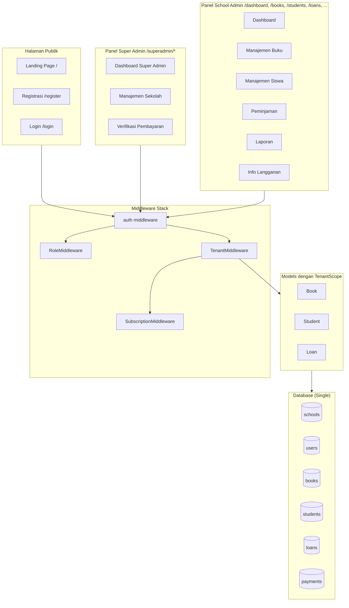
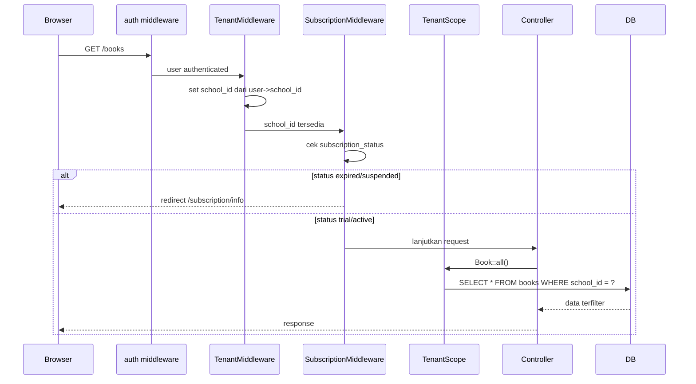
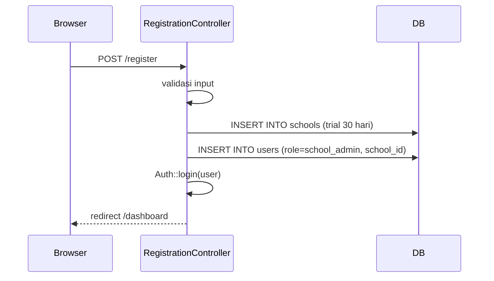
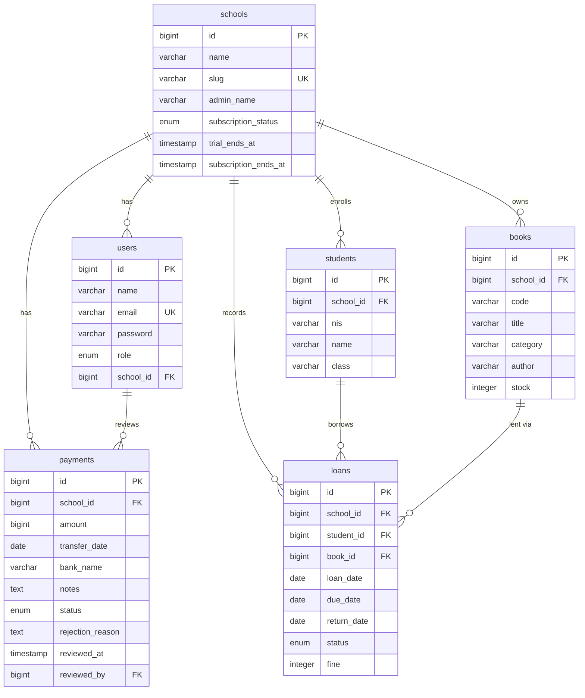

# Design Document: SaaS Multi-Tenant E-Perpustakaan

## Overview

Dokumen ini menjelaskan desain teknis untuk mengupgrade aplikasi e-perpustakaan sekolah (Laravel 12, PHP 8.2, MySQL) dari arsitektur single-tenant menjadi platform SaaS multi-tenant. Pendekatan yang dipilih adalah **single-database multi-tenancy** menggunakan kolom `school_id` sebagai discriminator pada setiap tabel data perpustakaan.

Tiga lapisan utama sistem:
1. **Halaman Publik** — landing page dan registrasi sekolah baru
2. **Panel Super Admin** — manajemen seluruh tenant, verifikasi pembayaran, statistik platform
3. **Panel School Admin** — evolusi dari aplikasi perpustakaan existing, terisolasi per sekolah

Routing menggunakan **path-based** (bukan subdomain) karena dijalankan di lingkungan lokal (`localhost/e-perpus/public/`). Monetisasi melalui langganan tahunan Rp 1.500.000 dengan konfirmasi pembayaran manual oleh Super Admin.

### Keputusan Desain Utama

| Keputusan | Pilihan | Alasan |
|---|---|---|
| Multi-tenancy strategy | Single DB + `school_id` | Sederhana, cocok untuk skala awal, tidak perlu infrastruktur terpisah |
| Routing | Path-based (`/dashboard`, `/superadmin/`) | Kompatibel dengan localhost tanpa konfigurasi DNS |
| Tenant isolation | Laravel Global Scope (TenantScope) | Otomatis, tidak perlu modifikasi setiap query |
| Pembayaran | Manual transfer + konfirmasi Super Admin | Tidak perlu payment gateway, cocok untuk pasar lokal |
| Role system | Kolom `role` pada tabel `users` | Sederhana, tidak perlu package tambahan |

---

## Architecture

### Diagram Arsitektur Sistem



### Alur Request School Admin



### Alur Registrasi Sekolah Baru



---

## Components and Interfaces

### 1. Models

#### School (Model Baru)
```php
// app/Models/School.php
class School extends Model
{
    // Attributes: id, name, slug, admin_name,
    //   subscription_status (trial|active|expired|suspended),
    //   trial_ends_at, subscription_ends_at, created_at, updated_at

    public function users(): HasMany
    public function books(): HasMany
    public function students(): HasMany
    public function loans(): HasMany
    public function payments(): HasMany

    // Helper methods
    public function isActive(): bool       // trial atau active
    public function daysRemaining(): int   // sisa hari trial/langganan
    public function isExpired(): bool
}
```

#### Payment (Model Baru)
```php
// app/Models/Payment.php
class Payment extends Model
{
    // Attributes: id, school_id, amount, transfer_date, bank_name,
    //   notes, status (pending|approved|rejected),
    //   rejection_reason, reviewed_at, reviewed_by, created_at, updated_at

    public function school(): BelongsTo
    public function reviewer(): BelongsTo  // User (super_admin)
}
```

#### TenantScope (Global Scope Baru)
```php
// app/Models/Scopes/TenantScope.php
class TenantScope implements Scope
{
    public function apply(Builder $builder, Model $model): void
    // Menambahkan WHERE school_id = ? berdasarkan session/context
}
```

#### Modifikasi Model Existing

Model `Book`, `Student`, dan `Loan` akan dimodifikasi:
- Tambah `school_id` ke `$fillable`
- Tambah `static::addGlobalScope(new TenantScope())` di `booted()`
- Tambah relasi `school(): BelongsTo`

Model `User` akan dimodifikasi:
- Tambah kolom `role` dan `school_id` ke `$fillable`
- Tambah relasi `school(): BelongsTo`
- Tambah helper `isSuperAdmin(): bool`, `isSchoolAdmin(): bool`

### 2. Middleware

#### TenantMiddleware (Baru)
```php
// app/Http/Middleware/TenantMiddleware.php
class TenantMiddleware
{
    public function handle(Request $request, Closure $next): Response
    // 1. Ambil school_id dari Auth::user()->school_id
    // 2. Simpan ke app()->instance('current_school_id', $schoolId)
    // 3. Lanjutkan request
}
```

#### SubscriptionMiddleware (Baru)
```php
// app/Http/Middleware/SubscriptionMiddleware.php
class SubscriptionMiddleware
{
    public function handle(Request $request, Closure $next): Response
    // 1. Load School dari school_id
    // 2. Jika expired/suspended dan bukan route pembayaran → redirect
    // 3. Lanjutkan request
}
```

#### RoleMiddleware (Baru)
```php
// app/Http/Middleware/RoleMiddleware.php
class RoleMiddleware
{
    public function handle(Request $request, Closure $next, string $role): Response
    // Cek Auth::user()->role === $role, jika tidak → abort(403)
}
```

### 3. Controllers (Baru)

| Controller | Path | Tanggung Jawab |
|---|---|---|
| `RegistrationController` | `/register` | Form registrasi sekolah baru |
| `LandingController` | `/` | Halaman landing publik |
| `SubscriptionController` | `/subscription/*` | Info langganan, form pembayaran, riwayat |
| `SuperAdmin\DashboardController` | `/superadmin/dashboard` | Statistik platform |
| `SuperAdmin\SchoolController` | `/superadmin/schools/*` | Manajemen daftar sekolah |
| `SuperAdmin\PaymentController` | `/superadmin/payments/*` | Verifikasi pembayaran |

### 4. Route Structure

```
GET  /                          → LandingController@index
GET  /register                  → RegistrationController@show
POST /register                  → RegistrationController@store
GET  /login                     → AuthController@showLogin (dimodifikasi)
POST /login                     → AuthController@login (dimodifikasi)
POST /logout                    → AuthController@logout

// School Admin routes (middleware: auth, tenant, subscription)
GET  /dashboard                 → DashboardController@index
GET  /subscription/info         → SubscriptionController@info
GET  /subscription/payment      → SubscriptionController@paymentForm
POST /subscription/payment      → SubscriptionController@submitPayment
GET  /subscription/history      → SubscriptionController@history
resource /books                 → BookController
resource /students              → StudentController
resource /loans                 → LoanController (except edit, update)
PATCH /loans/{loan}/return      → LoanController@returnBook
GET  /reports                   → ReportController@index
GET  /reports/export            → ReportController@export

// Super Admin routes (middleware: auth, role:super_admin)
GET  /superadmin/dashboard      → SuperAdmin\DashboardController@index
GET  /superadmin/schools        → SuperAdmin\SchoolController@index
PATCH /superadmin/schools/{id}/status → SuperAdmin\SchoolController@updateStatus
GET  /superadmin/payments       → SuperAdmin\PaymentController@index
PATCH /superadmin/payments/{id}/approve → SuperAdmin\PaymentController@approve
PATCH /superadmin/payments/{id}/reject  → SuperAdmin\PaymentController@reject
```

---

## Data Models

### Schema Database

#### Tabel Baru: `schools`

```sql
CREATE TABLE schools (
    id                   BIGINT UNSIGNED AUTO_INCREMENT PRIMARY KEY,
    name                 VARCHAR(255) NOT NULL COMMENT 'Nama sekolah',
    slug                 VARCHAR(50) NOT NULL UNIQUE COMMENT 'Identifier unik sekolah',
    admin_name           VARCHAR(255) NOT NULL COMMENT 'Nama penanggung jawab',
    subscription_status  ENUM('trial','active','expired','suspended') NOT NULL DEFAULT 'trial',
    trial_ends_at        TIMESTAMP NULL COMMENT 'Berakhir trial (30 hari dari registrasi)',
    subscription_ends_at TIMESTAMP NULL COMMENT 'Berakhir langganan berbayar',
    created_at           TIMESTAMP NULL,
    updated_at           TIMESTAMP NULL
);
```

#### Tabel Baru: `payments`

```sql
CREATE TABLE payments (
    id               BIGINT UNSIGNED AUTO_INCREMENT PRIMARY KEY,
    school_id        BIGINT UNSIGNED NOT NULL,
    amount           BIGINT NOT NULL COMMENT 'Nominal transfer (Rupiah)',
    transfer_date    DATE NOT NULL COMMENT 'Tanggal transfer',
    bank_name        VARCHAR(100) NOT NULL COMMENT 'Nama bank pengirim',
    notes            TEXT NULL COMMENT 'Catatan opsional',
    status           ENUM('pending','approved','rejected') NOT NULL DEFAULT 'pending',
    rejection_reason TEXT NULL COMMENT 'Alasan penolakan oleh Super Admin',
    reviewed_at      TIMESTAMP NULL,
    reviewed_by      BIGINT UNSIGNED NULL COMMENT 'ID Super Admin yang mereview',
    created_at       TIMESTAMP NULL,
    updated_at       TIMESTAMP NULL,
    FOREIGN KEY (school_id) REFERENCES schools(id) ON DELETE CASCADE,
    FOREIGN KEY (reviewed_by) REFERENCES users(id) ON DELETE SET NULL
);
```

#### Modifikasi Tabel Existing

**`users`** — tambah kolom:
```sql
ALTER TABLE users
    ADD COLUMN role      ENUM('super_admin','school_admin') NOT NULL DEFAULT 'school_admin' AFTER email,
    ADD COLUMN school_id BIGINT UNSIGNED NULL AFTER role,
    ADD FOREIGN KEY (school_id) REFERENCES schools(id) ON DELETE SET NULL;
```

**`books`** — tambah kolom:
```sql
ALTER TABLE books
    ADD COLUMN school_id BIGINT UNSIGNED NOT NULL AFTER id,
    ADD FOREIGN KEY (school_id) REFERENCES schools(id) ON DELETE CASCADE;
-- Constraint UNIQUE pada (school_id, code) menggantikan UNIQUE(code)
```

**`students`** — tambah kolom:
```sql
ALTER TABLE students
    ADD COLUMN school_id BIGINT UNSIGNED NOT NULL AFTER id,
    ADD FOREIGN KEY (school_id) REFERENCES schools(id) ON DELETE CASCADE;
-- Constraint UNIQUE pada (school_id, nis) menggantikan UNIQUE(nis)
```

**`loans`** — tambah kolom:
```sql
ALTER TABLE loans
    ADD COLUMN school_id BIGINT UNSIGNED NOT NULL AFTER id,
    ADD FOREIGN KEY (school_id) REFERENCES schools(id) ON DELETE CASCADE;
-- Constraint UNIQUE pada (school_id, code) menggantikan UNIQUE(code)
```

### Diagram Entity-Relationship



### Strategi Migrasi Data Existing

Karena database sudah berisi data, migrasi harus dilakukan secara bertahap:

1. **Migration 1**: Buat tabel `schools` dan `payments`
2. **Migration 2**: Tambah kolom `role` dan `school_id` ke `users` (nullable dulu)
3. **Migration 3**: Tambah kolom `school_id` ke `books`, `students`, `loans` (nullable dulu, dengan default)
4. **Migration 4**: Ubah constraint UNIQUE pada `books.code`, `students.nis`, `loans.code` menjadi composite unique per `school_id`
5. **Seeder**: Buat School default → update semua data existing → set NOT NULL constraint
6. **Seeder**: Buat akun `super_admin`, update akun admin existing menjadi `school_admin`

---

## Correctness Properties


*A property is a characteristic or behavior that should hold true across all valid executions of a system — essentially, a formal statement about what the system should do. Properties serve as the bridge between human-readable specifications and machine-verifiable correctness guarantees.*

### Property 1: Registrasi membuat School, Admin, dan Trial

*For any* data registrasi yang valid (nama sekolah, slug unik, nama admin, email unik, password), proses registrasi SHALL menghasilkan tepat satu record School baru, tepat satu User baru dengan role `school_admin` yang terhubung ke School tersebut, dan `trial_ends_at` = waktu registrasi + 30 hari.

**Validates: Requirements 1.2, 1.5**

---

### Property 2: Validasi Format Slug

*For any* string input sebagai slug, sistem SHALL menerima string tersebut jika dan hanya jika string tersebut hanya mengandung huruf kecil (a-z), angka (0-9), dan tanda hubung (-), dengan panjang antara 3 dan 50 karakter. Semua string lain SHALL ditolak.

**Validates: Requirements 1.6**

---

### Property 3: Keunikan Slug dan Email

*For any* pasangan (email, slug) yang sudah terdaftar di sistem, upaya registrasi baru menggunakan email yang sama ATAU slug yang sama SHALL selalu ditolak dengan pesan error yang spesifik pada field yang bermasalah.

**Validates: Requirements 1.3, 2.2**

---

### Property 4: Round-Trip Data School

*For any* data School yang valid, menyimpan data tersebut ke database dan kemudian membacanya kembali SHALL menghasilkan data yang identik untuk semua atribut: `name`, `slug`, `admin_name`, `subscription_status`, `trial_ends_at`, `subscription_ends_at`.

**Validates: Requirements 2.1**

---

### Property 5: Deteksi Kedaluwarsa Langganan

*For any* School dengan `trial_ends_at` atau `subscription_ends_at` di masa lalu (lebih kecil dari waktu sekarang), metode `isExpired()` SHALL mengembalikan `true`. *For any* School dengan tanggal tersebut di masa depan, `isExpired()` SHALL mengembalikan `false`.

**Validates: Requirements 2.3, 2.4**

---

### Property 6: Isolasi Data Antar Tenant (TenantScope)

*For any* dua sekolah A dan B yang masing-masing memiliki data Book, Student, dan Loan, ketika TenantScope aktif dengan konteks school_id = A, semua query terhadap model Book, Student, dan Loan SHALL hanya mengembalikan record yang memiliki `school_id` = A. Tidak ada record milik sekolah B yang boleh muncul.

**Validates: Requirements 3.2, 3.3, 8.5**

---

### Property 7: Proteksi Akses Cross-Tenant (404)

*For any* resource (Book, Student, atau Loan) milik sekolah A, ketika School_Admin dari sekolah B mencoba mengakses resource tersebut secara langsung via URL, sistem SHALL mengembalikan respons 404 Not Found.

**Validates: Requirements 3.4**

---

### Property 8: Auto-Fill school_id Saat Membuat Data

*For any* School_Admin yang sedang login dengan `school_id` = X, ketika School_Admin tersebut membuat data baru (Book, Student, atau Loan) tanpa menyertakan `school_id` secara eksplisit, sistem SHALL secara otomatis mengisi `school_id` = X pada record yang tersimpan.

**Validates: Requirements 3.5**

---

### Property 9: Status Langganan Mengontrol Akses (dengan Pengecualian Route Pembayaran)

*For any* School dengan `subscription_status` = `trial` atau `active`, semua request ke route perpustakaan SHALL diizinkan (HTTP 200). *For any* School dengan `subscription_status` = `expired` atau `suspended`, semua request ke route perpustakaan SHALL di-redirect ke halaman info langganan, **kecuali** request ke route pembayaran (`/subscription/payment`, `/subscription/history`, `/subscription/info`) yang SHALL tetap dapat diakses.

**Validates: Requirements 4.1, 4.2, 8.4**

---

### Property 10: Kalkulasi Sisa Hari Langganan

*For any* School dengan `trial_ends_at` = T atau `subscription_ends_at` = T, metode `daysRemaining()` SHALL mengembalikan nilai yang sama dengan selisih hari antara T dan hari ini (dibulatkan ke bawah). Jika T sudah lewat, SHALL mengembalikan 0 atau nilai negatif.

**Validates: Requirements 4.3**

---

### Property 11: Submission Pembayaran Membuat Record Pending

*For any* data pembayaran yang valid (amount, transfer_date, bank_name), ketika School_Admin mengirimkan form pembayaran, sistem SHALL menyimpan tepat satu record Payment baru dengan `status` = `pending`, `school_id` yang sesuai dengan sekolah School_Admin tersebut, dan semua atribut yang dikirimkan tersimpan dengan benar.

**Validates: Requirements 5.2, 5.3**

---

### Property 12: Approval Pembayaran Mengupdate School dan Mencatat Audit

*For any* Payment dengan `status` = `pending`, ketika Super_Admin menyetujui Payment tersebut, sistem SHALL secara atomik: (1) mengubah `Payment.status` menjadi `approved`, (2) mengubah `School.subscription_status` menjadi `active`, (3) menetapkan `School.subscription_ends_at` = `reviewed_at` + 1 tahun, (4) mencatat `reviewed_at` = timestamp saat ini, dan (5) mencatat `reviewed_by` = ID Super_Admin yang melakukan aksi.

**Validates: Requirements 5.4, 6.6**

---

### Property 13: Penolakan Pembayaran Menyimpan Alasan dan Audit

*For any* Payment dengan `status` = `pending` dan alasan penolakan yang diberikan, ketika Super_Admin menolak Payment tersebut, sistem SHALL mengubah `Payment.status` menjadi `rejected`, menyimpan `rejection_reason` yang diberikan, mencatat `reviewed_at` = timestamp saat ini, dan mencatat `reviewed_by` = ID Super_Admin yang melakukan aksi.

**Validates: Requirements 5.5, 6.6**

---

### Property 14: Isolasi Riwayat Pembayaran Per Sekolah

*For any* dua sekolah A dan B yang masing-masing memiliki Payment, ketika School_Admin dari sekolah A mengakses riwayat pembayaran, sistem SHALL hanya menampilkan Payment milik sekolah A. Tidak ada Payment milik sekolah B yang boleh muncul.

**Validates: Requirements 5.6**

---

### Property 15: Super Admin Melihat Semua Sekolah

*For any* jumlah N sekolah yang terdaftar di sistem, ketika Super_Admin mengakses daftar sekolah, sistem SHALL menampilkan semua N sekolah tanpa filter berdasarkan `school_id`.

**Validates: Requirements 6.3**

---

### Property 16: Akurasi Statistik Dashboard Super Admin

*For any* distribusi sekolah dengan status `trial`, `active`, `expired`, `suspended` dan total Payment `approved`, dashboard Super_Admin SHALL menampilkan angka yang tepat sesuai dengan data aktual di database untuk setiap kategori statistik.

**Validates: Requirements 6.2**

---

### Property 17: Proteksi Route Berdasarkan Role

*For any* route di bawah prefix `/superadmin/`, pengguna dengan role `school_admin` SHALL selalu mendapatkan respons 403 Forbidden. Pengguna dengan role `super_admin` SHALL dapat mengakses route tersebut. Sebaliknya, pengguna dengan role `super_admin` tidak terikat TenantScope dan dapat mengakses data lintas tenant.

**Validates: Requirements 6.7, 7.4, 7.5**

---

### Property 18: Redirect Pasca-Login Berdasarkan Role

*For any* pengguna yang berhasil login, sistem SHALL mengarahkan pengguna dengan role `super_admin` ke `/superadmin/dashboard` dan pengguna dengan role `school_admin` ke `/dashboard`. Perilaku yang sama berlaku ketika pengguna yang sudah login mengakses halaman `/` atau `/login`.

**Validates: Requirements 7.3, 10.3**

---

### Property 19: Redirect ke Login untuk Request Tidak Terautentikasi

*For any* route yang dilindungi (semua route kecuali `/`, `/login`, `/register`), ketika pengguna yang belum login mencoba mengaksesnya, sistem SHALL selalu mengarahkan ke halaman `/login`.

**Validates: Requirements 7.6**

---

### Property 20: Integritas Data Saat Migrasi

*For any* database yang sudah berisi data pada tabel `books`, `students`, dan `loans`, setelah menjalankan migration penambahan kolom `school_id`, jumlah total record pada setiap tabel SHALL tetap sama dengan jumlah sebelum migration. Tidak ada record yang boleh hilang atau rusak.

**Validates: Requirements 9.4**

---

## Error Handling

### Kategori Error dan Penanganannya

| Skenario | Penanganan |
|---|---|
| Registrasi dengan email/slug duplikat | Validasi Laravel, kembalikan error per-field, input lain dipertahankan |
| School_Admin akses resource tenant lain | TenantScope + `findOrFail()` → 404 Not Found |
| School_Admin akses route superadmin | RoleMiddleware → 403 Forbidden |
| Pengguna tidak login akses route protected | Laravel `auth` middleware → redirect `/login` |
| School dengan status expired/suspended akses fitur | SubscriptionMiddleware → redirect `/subscription/info` |
| Super_Admin approve/reject Payment yang sudah diproses | Validasi status Payment sebelum aksi, kembalikan error jika sudah bukan `pending` |
| Slug dengan format tidak valid | Validasi regex di RegistrationController, pesan error spesifik |
| Migration pada database berisi data | Gunakan nullable column + seeder untuk backfill, baru tambah NOT NULL constraint |

### Penanganan Error di TenantScope

```php
// TenantScope harus graceful jika school_id belum tersedia
// (misalnya saat Super Admin mengakses tanpa scope)
public function apply(Builder $builder, Model $model): void
{
    $schoolId = app()->bound('current_school_id')
        ? app()->make('current_school_id')
        : null;

    if ($schoolId !== null) {
        $builder->where($model->getTable() . '.school_id', $schoolId);
    }
    // Super Admin: school_id null → tidak ada filter → lihat semua data
}
```

### Validasi Slug

```php
// RegistrationController
'slug' => [
    'required',
    'string',
    'min:3',
    'max:50',
    'regex:/^[a-z0-9\-]+$/',
    'unique:schools,slug',
],
```

---

## Testing Strategy

### Pendekatan Pengujian

Fitur ini menggunakan **dual testing approach**:
- **Unit/Feature Tests**: Verifikasi contoh spesifik, edge case, dan kondisi error
- **Property-Based Tests**: Verifikasi properti universal yang berlaku untuk semua input valid

### Library Property-Based Testing

Gunakan **[Eris](https://github.com/giorgiosironi/eris)** — library PBT untuk PHP yang terintegrasi dengan PHPUnit. Setiap property test dikonfigurasi untuk minimum **100 iterasi**.

```bash
composer require --dev giorgiosironi/eris
```

### Struktur Test

```
tests/
├── Feature/
│   ├── Registration/
│   │   ├── RegistrationTest.php          # Property 1, 2, 3 (feature tests)
│   │   └── RegistrationPropertyTest.php  # Property 1, 2, 3 (PBT)
│   ├── Tenancy/
│   │   ├── TenantScopeTest.php           # Property 6, 7, 8
│   │   └── TenantScopePropertyTest.php   # Property 6, 7, 8 (PBT)
│   ├── Subscription/
│   │   ├── SubscriptionAccessTest.php    # Property 9, 10
│   │   └── SubscriptionPropertyTest.php  # Property 9, 10 (PBT)
│   ├── Payment/
│   │   ├── PaymentWorkflowTest.php       # Property 11, 12, 13, 14
│   │   └── PaymentPropertyTest.php       # Property 11, 12, 13, 14 (PBT)
│   ├── SuperAdmin/
│   │   ├── SuperAdminAccessTest.php      # Property 15, 16, 17
│   │   └── SuperAdminPropertyTest.php    # Property 15, 16, 17 (PBT)
│   └── Auth/
│       ├── AuthRedirectTest.php          # Property 18, 19
│       └── AuthPropertyTest.php          # Property 18, 19 (PBT)
├── Unit/
│   ├── SchoolModelTest.php               # Property 4, 5 (unit)
│   └── SchoolModelPropertyTest.php       # Property 4, 5 (PBT)
└── Smoke/
    ├── RouteAccessibilityTest.php        # Req 1.1, 4.5, 6.1, 10.1
    └── SchemaTest.php                    # Req 3.1, 7.1, 7.2, 9.1
```

### Konfigurasi Property Test

Setiap property test harus:
1. Menggunakan `Eris\TestTrait` dan `Eris\Generator`
2. Dikonfigurasi dengan `->hook(Eris\Hook\MinimumEvaluations::times(100))`
3. Diberi tag komentar referensi ke property di design document

```php
// Contoh format tag
/**
 * Feature: saas-multi-tenant, Property 6: TenantScope data isolation
 * Validates: Requirements 3.2, 3.3, 8.5
 */
public function test_tenant_scope_isolates_data(): void
{
    $this->forAll(
        Generator\choose(1, 100),  // jumlah buku sekolah A
        Generator\choose(1, 100),  // jumlah buku sekolah B
    )->hook(Eris\Hook\MinimumEvaluations::times(100))
    ->then(function (int $countA, int $countB) {
        // setup, act, assert
    });
}
```

### Unit Tests (Contoh Spesifik)

Unit tests fokus pada:
- Contoh konkret yang mendemonstrasikan perilaku benar
- Edge case: slug dengan panjang tepat 3 dan 50 karakter, sisa hari = 7 (threshold warning)
- Kondisi error: Payment yang sudah approved tidak bisa di-approve lagi
- Integrasi antar komponen: TenantMiddleware → TenantScope → Controller

### Smoke Tests

Smoke tests untuk verifikasi satu kali:
- Route `/`, `/register`, `/login` dapat diakses tanpa autentikasi (HTTP 200)
- Route `/superadmin/dashboard` dapat diakses oleh super_admin (HTTP 200)
- Schema database mengandung kolom `school_id` pada `books`, `students`, `loans`
- Schema database mengandung kolom `role` dan `school_id` pada `users`
- Route `/subscription/info` dapat diakses oleh school_admin dengan status expired

### Catatan Implementasi

- Gunakan `RefreshDatabase` trait pada semua test untuk isolasi
- Gunakan `DatabaseTransactions` untuk test yang tidak perlu reset penuh
- Buat `SchoolFactory`, `PaymentFactory` untuk generate test data
- Modifikasi `UserFactory` untuk support `role` dan `school_id`
- Gunakan `withoutMiddleware([SubscriptionMiddleware::class])` pada test yang fokus pada logika lain
